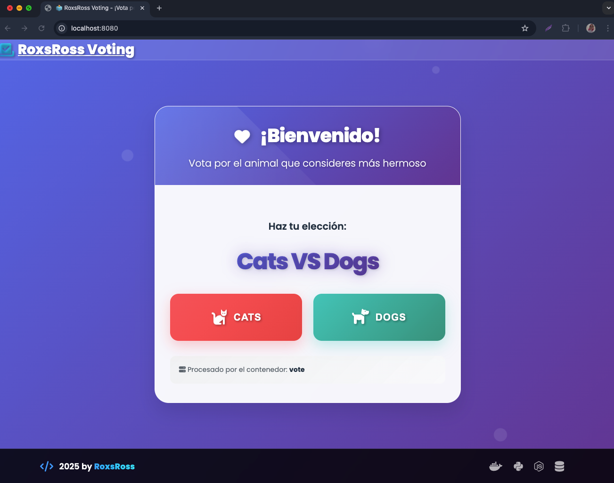
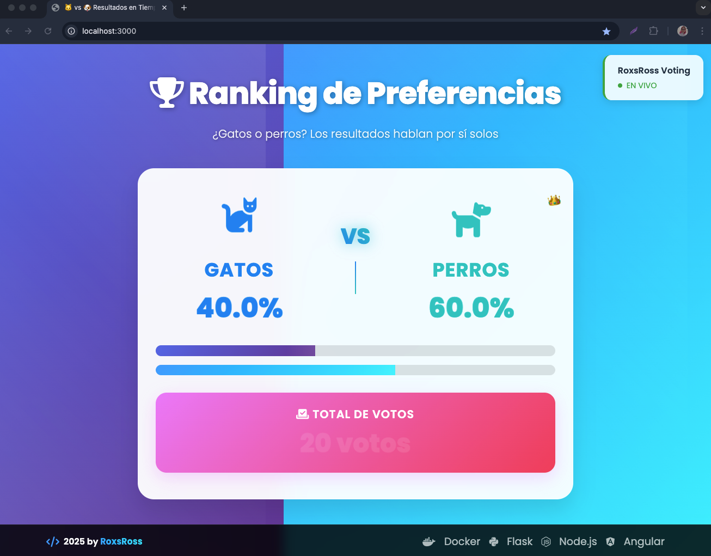
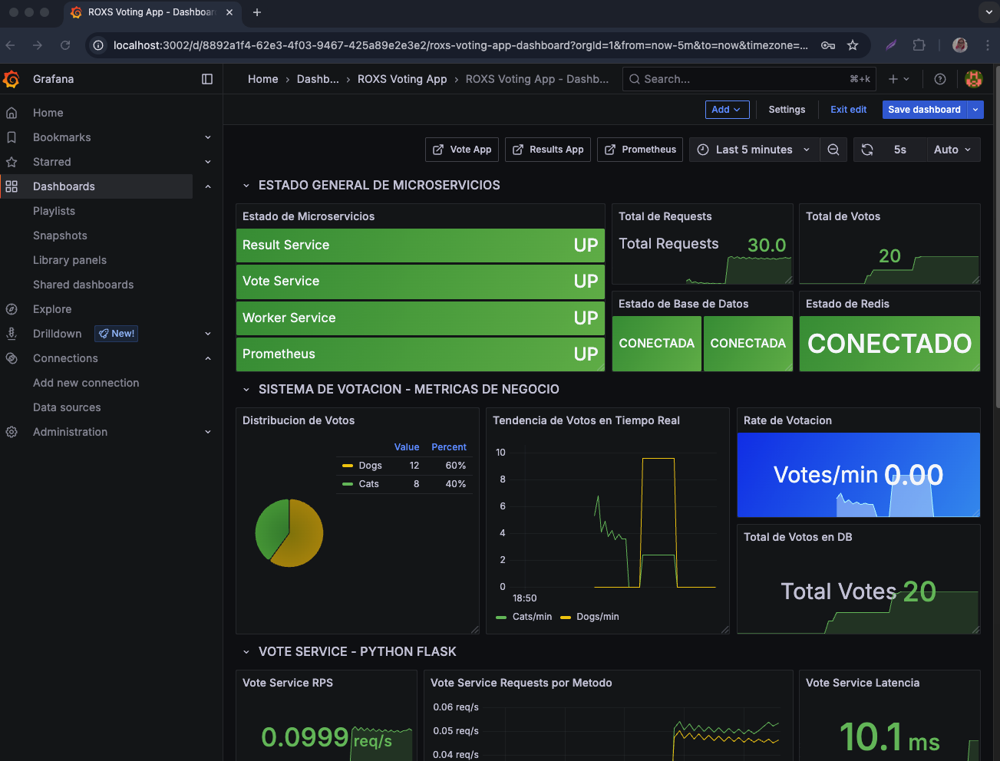
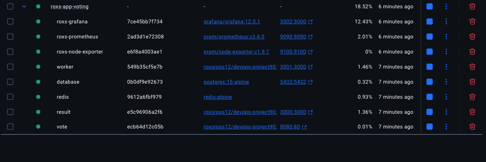
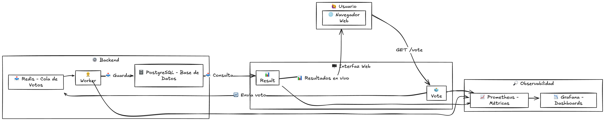

# 🚀 90 Días de DevOps con Roxs


## 📸 Screenshots del Ecosistema voting

<div align="center">

| 📦 Aplicación Principal | 📋 Resultados | 📊 🏠 Grafana Home | 🐳 Docker Containers |
|:---:|:---:|:---:|:---:|
|  |  |  |  |
| *Sistema de Votación* | *Web Resultados* | *Dash Grafana* | *Contenedores onfire* |

</div>

---

## 🧩 Arquitectura de la Aplicación

Este repositorio incluye el código base de una aplicación distribuida, compuesta por tres servicios:



- **Vote** : Servicio en Flask que permite votar (🐱 o 🐶) y publica los votos en Redis.
- **Worker** : Servicio Node.js que consume votos desde Redis y los guarda en PostgreSQL.
- **Result** : App Node.js que muestra los resultados en tiempo real usando WebSockets.

### 📦 Versiones recomendadas de los servicios

| Servicio | Lenguaje/Framework | Versión recomendada |
|----------|--------------------|---------------------|
| Vote     | Flask (Python)     | Python 3.13+, Flask 3.3+ |
| Worker   | Node.js            | Node.js 20.x+            |
| Result   | Node.js            | Node.js 20.x+            |
| Redis    | Redis                | Redis 6.x+                 |
| PostgreSQL| PostgreSQL          | PostgreSQL 15.x+           |

> ⚠️ Usar versiones iguales o superiores a las recomendadas asegura compatibilidad y soporte con las dependencias del proyecto.
---

## 🛠️ ¿Qué vas a construir?

A lo largo del programa, vos vas a encargarte de:

✅ Crear tus propios archivos `docker-compose.yml`  
✅ Automatizar la configuración con Ansible  
✅ Desplegar todo en local usando Terraform Provider Local  
✅ Crear pipelines CI/CD con GitHub Actions  
✅ Orquestar la app en Kubernetes  
✅ Monitorear con Prometheus y Grafana  
✅ (Opcional) Llevarlo a AWS

---

## 📂 Estructura del Repositorio

```bash
.
├── vote/             # Flask app (app.py)
├── worker/           # Worker Node.js (main.js)
├── result/           # Resultados en tiempo real (main.js)
├── views/            # HTML y frontend
├── load-testing/     # Pruebas de Carga y rendimiento con k6
├── README.md         # Este archivo ;)
````

> ⚠️ No se incluyen archivos de Docker, Terraform o CI/CD. Vos los vas a construir paso a paso como parte del desafío.

---

## 📈 Bonus: Métricas y Observabilidad

Todos los servicios están instrumentados con Prometheus. Podrás visualizar las métricas que vos mismo vas a recolectar y graficar con Grafana a partir de la semana 6.

---
## 💪 Motivación: ¿Por qué hacer este desafío?

Aprender DevOps puede parecer abrumador. Hay muchas herramientas, conceptos nuevos, y cientos de tutoriales que te dicen por dónde empezar… pero ninguno te lleva de la mano a construir algo real **desde cero**.

Este programa no es teoría vacía. Vas a **construir una app real**, como lo harías en un equipo profesional.
Acá vas a **equivocarte, arreglar, automatizar, monitorear y desplegar**.
Y cuando termines, vas a poder decir con orgullo: **yo hice esto** 💥

> 🧠 *"DevOps no se aprende en un curso, se aprende en la práctica. Y este es tu campo de juego."*


---

## 📄 Licencia

Este proyecto está licenciado bajo MIT License - ver el archivo [LICENSE](LICENSE) para detalles.

## 👨‍💻 Autor

**roxsross** - Instructor DevOps y Cloud

- 🐦 Twitter: [@roxsross](https://twitter.com/roxsross)
- 🔗 LinkedIn: [roxsross](https://linkedin.com/in/roxsross)
- ☕ Ko-fi [roxsross](https://ko-fi.com/roxsross)
- ▶️ Youtube [295devops](https://www.youtube.com/@295devops)
- 📧 Email: roxs@295devops.com

---

> 💡 Si querés sumar este desafío a tu portfolio o como parte de tu onboarding, ¡hacelo con orgullo! 💥


